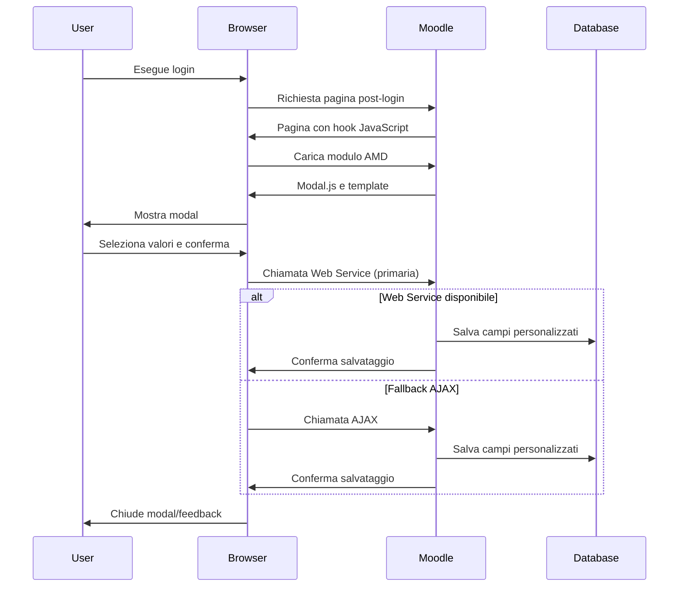

# WhereAreYou - Moodle Plugin

Un plugin moderno per Moodle 5+ che mostra una modal post-login per permettere agli utenti di specificare il proprio dipartimento e posizione.

## Caratteristiche

- Modal automatica dopo ogni login (sempre visibile)
- Campi Department e Position personalizzabili
- Salvataggio in campi personalizzati utente
- Compatibile con Moodle 5+
- Utilizza il nuovo sistema di hook (niente callback legacy)
- Design moderno e responsive
- Supporto multilingua (IT/EN)
- **Pagina di test per amministratori**

## Installazione

1. Copia il plugin in `$MOODLE/local/whereareyou`
2. Accedi come amministratore
3. Vai in Site administration > Notifications
4. Completa l'installazione
5. **IMPORTANTE**: Vai in Site administration > Development > Purge caches per compilare i moduli JavaScript

Il plugin creerà automaticamente:
- Categoria "Dove Sei Tu" nei campi profilo
- Campo personalizzato "Department" con opzioni: Pizzicaroli, Gesmundo, Remoto
- Campo personalizzato "Position" con opzioni: Preside, Insegnante, Alunno

## Funzionamento

- La modal appare automaticamente dopo ogni login
- L'utente deve selezionare dipartimento e posizione
- Due pulsanti disponibili: "Salva" e "Logout"
- I dati vengono salvati nei campi personalizzati del profilo
- La modal è sempre visibile (anche se i campi sono già compilati)

## Requisiti

- Moodle 5.0+
- PHP 8.0+
- JavaScript abilitato

## Supporto

Per problemi o domande, consulta la documentazione di Moodle o contatta l'amministratore del sistema.

# Panoramica Tecnica

## **Tipo**: Plugin Moodle con versioning (usa nuovo sistema Hook)

### **Architettura chiave**:
* Hook: Sistema moderno di hook per iniettare funzionalità
* Template: Mustache per rendering interfacce
* JavaScript: Moduli AMD/RequireJS per funzionalità client-side, NON USARE jquery
* AJAX: Endpoint per comunicazione asincrona
* Installazione: Setup automatico database/configurazione

### **File critici**:
* `ajax.php` - Endpoint AJAX
* `classes/hook_callbacks.php` - Logica principale hook
* `version.php` - Metadata plugin
* `amd/src/modal.js` - Modulo JavaScript principale
* `templates/modal.mustache` - Template interfaccia

## Flusso Funzionale

### **Flusso identificato (Modal post-login)**:
1. **Hook rileva evento** → inietta JavaScript nell'header della pagina
2. **JavaScript si carica** → utilizza RequireJS per caricare moduli
3. **Modal si attiva** → mostra interfaccia all'utente
4. **Utente interagisce** → seleziona opzioni e conferma
5. **Salvataggio AJAX** → invia dati al server per persistenza
6. **Controlli sessione** → previene ri-visualizzazione indesiderata

## NOTE
* L'Hook che rileva evento è costituito da [db/hooks.php](./db/hooks.php) il quale chiama [classes/hook_callbacks.php](./classes/hook_callbacks.php);

* In [classes/hook_callbacks.php](./classes/hook_callbacks.php) il codice JavaScript deve essere caricato con injection diretta, questo è cruciale.

* Il modulo Javascript denominato [modal.js](./amd/src/modal.js) viene compilato con grunt in [modal.min.js](./amd/build/modal.min.js).

* Lo status, il salvataggio dei dati ed il reset, vengono svolti dagli script in [classes/external](./classes/external/).

* Il [web service](./db/services.php) in realtà FUNZIONA - ma Il JavaScript usa PRIMA il web service, quindi fa il fallback su AJAX. Questo metodo è più professionale e segue le linee guida Moodle.

* La customizzazione dei campi `department` e `position` dell'esempio può essere customizzata su [db/install.php](./db/install.php).

* Nella creazione di questo codice ci si è avvalsi **pesantemente** della AI, in particolare di [Claude](https://claude.ai/new), [Gemini](https://gemini.google.com/), ma preziose informazioni sono venute anche da [deepseek](https://chat.deepseek.com/) ed altri. Per fornire un contesto, si raccomanda di usare lo script python presente in `bin/sunto.py`, che fornisce all'AI una documentazione strutturata di tutti i files php, js, mustache del plugin stesso.

* Pur avendo scritto il plugin, manca - non sono riuscito a trovarla - una documentazione esaustiva di come si scrivano i plugin per moodle, sembra un processo fluido più che solido e forse a questo ci dovremo abituare.

